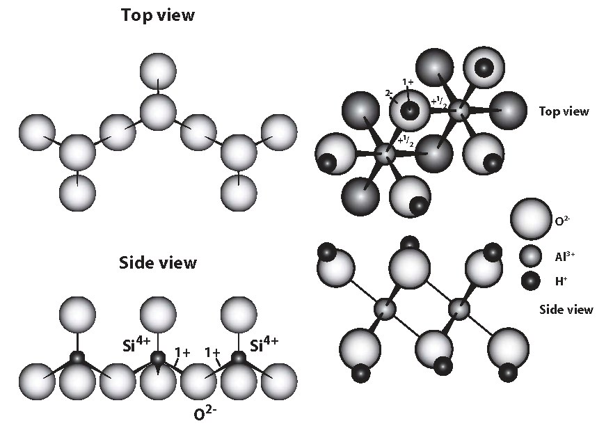
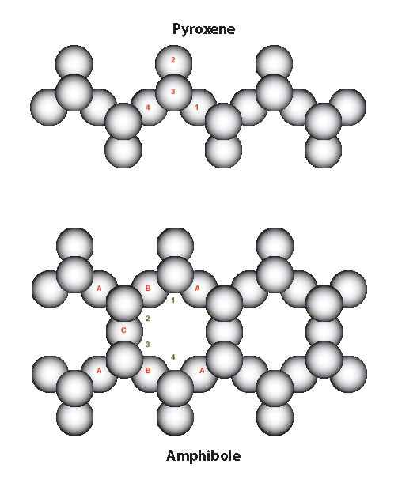
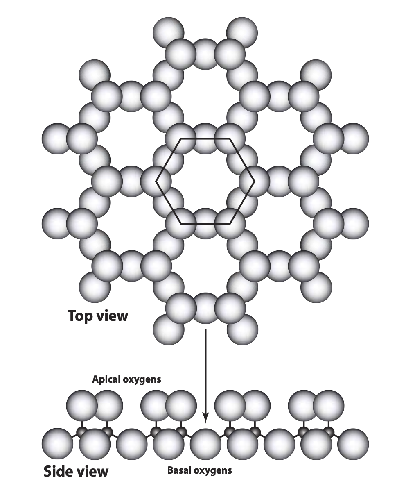

# Soil


Much of what's below comes from: Essington, M. 2004. *Soil and Water Chemistry: An Integrative Approach*, CRC Press, Chapter 2.

<br>

## Soil mineralogy - introductory ideas

Minerals in soils can be 

- crystalline - these are naturally occurring inorganic compounds with atoms in a 3-D structure that repeats

- amorphous - these are naturally occurring inorganic compounds with no repeating structure


The O^2-^ anion is the dominant anion in soil minerals (47% by weight).

The *coordination number* is the number of anions that can be packed around a cation with no overlap. The bigger the cation, the more anions that can fit around it.

The figure below from Essington shows how charges of bonds are counted.

First, a definition: bond strength = cation valence / coordination number.

On the left are silicon tetrahedra, with the Si^4+^ ions in tetrahedral coordination, each surrounded by four O^2-^ ions. The strength of each Si-O bond is +4 / 4 = +1. The tetrahedra are bonded through a shared basal corner O^2-^ ion. The 2- charge on the O ion is exactly balanced by the 1+ charge on each of the two Si ions it's bonded to.

On the right hand side are Al^3+^ ions in octahedral coordination, each surrounded by six OH^-^ ions. The strength of each Al-OH bond is +3 / 6 = +1/2. Consequently, each OH^-^ ion can only be bonded by two Al^3+^ ions. The -2 charge on each O^2-^ ion is exactly balanced by its bond with two Al^3+^ ions and one H^+^ ion.


```{r echo = F, out.width = '80%', fig.align = 'center', fig.cap = 'Essington, Fig. 2.5, p. 41'}



```


A *unit cell* of a crystal is the smallest three-dimensional repeating unit of atoms. 


The most commonly occurring minerals in soil are the silicates. One class of silicates, the phyllosilicates or clay minerals, has a substantial effect on the physical and chemical properties of soil.

The *primary silicate minerals* formed as liquid magma cooled and make up the bulk of the sand- and silt-sized fractions of soil.

The *secondary silicate minerals*, formed from the weathering of the primary silicates or from precipitation of soluble mineral material, are found mainly in the clay fraction of soil and are responsible for many chemical reactions in soils.

<br>

## Climate

### Moisture

In moist or humid climates, water moves downwards, on balance, for most of the year. This leads to leaching of soluble minerals and translocation downwards of clay particles.


In arid climates, water moves upwards, on balance, over the year. This leads to salts being brought up the soil profile and closer to the surface.

### Temperature

Temperature affects the rate of mineral weathering and formation and biological processes, such as growth and decomposition.


<br>

## Parent material

Rocks are classified as igneous, sedimentary or metamorphic.


Notes below are based on:
https://australian.museum/learn/minerals/shaping-earth/classification-of-igneous-rocks/

### Igneous rocks

- these are formed by the solidification of molten magma in the Earth's crust or on the surface of the Earth's crust
- they are divided into classes based on grain size and silica content:

  - grain size
    - volcanic rocks - they solidify close to the Earth's surface and so cool quickly; they have finer grains
    - plutonic rocks - they solidify deep in the Earth's crust and cool slowly; they have coarse grains
    
  - silica content
    - *acidic* - rocks with more than 63% silica (mostly light-coloured K/Na feldspars and quartz); mainly *instrusive* (i.e. forming within the crust) - e.g. granite
    - *basic* - rocks with 45% to 55% quartz but high in dark-coloured ferromagnesian minerals (i.e. Fe and Mg) and Ca feldspars; mainly *extrusive* (i.e. forming on Earth's surface from lava) - e.g. basalt
    
    
### Metamorphic rocks

Igneous and sedimentary rocks that are subjected to high temperature and pressure have their mineral composition and structure changed and are transformed into metamorphic rocks. 

Under high temperature and pressure, existing minerals break down and form new minerals. Particular pressure/temperature conditions cause particular *index minerals* to form and these minerals can be used as one classifying feature of metamorphic rocks.

Apart from index minerals, other classifying features are grain size and degree of foliation.

Texture:

- foliated (leaf-like layers) - newly formed minerals align themselves perpendicular to the direction of stress; metamorphic rocks break easily along foliation planes
- non-foliated, massive or granular - a granular texture develops if a rock's chemical composition is similar to that of a particular mineral (e.g. marble - see below)

As the grade of metamorphism increases (i.e. higher pressure and temperature), crystal size increases and foliation becomes coarser (e.g. in limestone, calcite recrystallises into larger crystals and forms marble).


|               | Grain size |           |
|:--------------|:-----------|:----------|
| **Foliation** | Fine       |  Coarse   |
| Poor          | Hornfels   | Marble, quartzite|
| Good          | Slate      | Gneiss    |


### Sedimentary rocks

These are composed of the products of the weathering of igneous and metamorphic rocks and are formed when these products are deposited by wind or water. As more and more sediment layers are laid down, they exert weight on  deeper sediments, which harden and form rock.

Some sedimentary rocks form by precipitation of minerals, such as limestone.

<br>


## Chain silicates

In the figure below, silicon tetrahedra are shwon linked into single chains (top) and double chains (bottom).

Pyroxenes are made up of single chains of silicon tetrahedra linked through basal oxygen atoms. The basic unit is SiO~3~^2-^. How do you get this unit formula? Each Si-O bond has a strength of +4 / 4 = +1. The four O atoms in a single tetrahedron in focus are numbered. O no. 1 is shared with the neighbouring Si atom, so only half of it "belongs to" the tetrahedron in question. O nos. 2 and 3 both belong wholly to the focal tetrahedron. Like O no. 1, only half of O no. 4 is counted. So, there are one Si atom and three O atoms in the basic pyroxene unit, giving SiO~3~^2-^.

Amphiboles are made up of double chains of silicon tetrahedra linked through basal oxygen atoms. The basic unit is Si~4~O~11~^2-^. How so? The Si atoms are numbered 1 to 4. The set of tetrahedra with these Si atoms constitutes the basic repeating unit of the chains. Some of the oxygen atoms in this unit are marked in groups (with A, B and C), while the other six O atoms in the repeating unit are unmarked. Again, each Si-O bond has a strength of +1.

- The six unmarked O atoms in the unit belong wholly to the unit and contribute their full value. Contribution here is 6.

- O atoms marked A are shared with Si atoms in neighbouring tetrahedra, so each contributes half to the basic unit. Contribution here is 2.

- One of the O atoms marked B is shared between Si atoms 1 and 2 (i.e. half with each Si atom), both of which are in the basic unit, so that O atom contributes its full worth. The other O atom marked B is shared in the same way with Si atoms 3 and 4 and also contributes its full worth. Contribution here is 2.

- Oxygen atom C is shared in a similar way to the Bs, so also contributes its full worth. Contribution here is 1.

- Total oxygen "value" is 11.

This gives the basic unit of Si~4~O~11~^2-^.


```{r echo = F, out.width = '80%', fig.align = 'center', fig.cap = 'Essington, Fig. 2.10, p. 49'}



```


<br>

## Phyllosilicates

Phyllosilicates are sheet silicates or layer silicates. The basic unit is Si~2~O~5~^2-^. Each individual tetrahedron shares three basal O atoms, as shown below. The result is a sheet structure.


```{r echo = F, out.width = '80%', fig.align = 'center', fig.cap = 'Essington, Fig. 2.11, p. 50'}



```


An example of primary phyllosilicate minerals is the micas. They are 2:1 layer silicates - i.e. two silicate tetrahedral sheets sandwiching an octahedral sheet.

The basic unit of the octahedral sheets is three octahedra. If two out of the three positions available in the octahedra for cations are occupied by cations, the sheet is dioctahedral. If all three positions are occupied, the sheet is trioctahedral.

Isomorphous substitution occurs when an atom replaces another atom which has a similar size - e.g. Al^3+^ can replace Si^4+^ in a tetrahedral sheet and Fe^2+^, Fe^3+^ or Mg^2+^ can replace Al^3+^ in octahedral sheets.

If Al^3+^ substitutes for Si^4+^ in a tetrahedral layer in a dioctahedral mica, there will be a charge deficit of -1. This is balanced by K^+^ ions in the interlayer space.

In trioctahedral micas, the three octahedral spaces are occupied by divalent cations (e.g. Mg^2+^) to maintain the charge balance. If Al^3+^ substitutes for Si^4+^ in a tetrahedral layer in a trioctahedral mica, there will be a charge deficit of -1. This is balanced by K^+^ ions in the interlayer space, as in the dioctahedral case.

<br>

## Clay mineralogy

Clay minerals or clay material is made up of:

- phyllosilicates, of which there are three types, based on the ratio of tetrahedral to octahedral sheets

  - 1:1
  
  - 2:1
  
  - interlayered 1:1, 2:1 and octahedra

- accessory minerals - i.e. metal oxides, hydroxides and oxyhydroxides and organic matter.


### 1:1 phyllosilicates

Dioctahedral: kaolinite group

- Kaolinite is probably the most common aluminosilicate mineral in soil. 

- Its 1:1 layers are held together quite tightly by hydrogen bonding. It has low CEC (it has a little isomorphous substitution and also has some edge charge due to protonation and deprotonation).

Trioctahedral: serpentine group

### 2:1 phyllosilicates

These minerals are can be grouped according to layer charge.

The *mica* group, which consists of primary minerals, has a layer charge of about 0.6 to 2, due to isomorphous substitution (note that vermiculite is a secondary mineral derived from mica).

The *smectite* group has a layer charge of up to about 0.6 and includes both dioctahedral and trioctahedral minerals.

- As the layer charge of smectites is fairly low, water molecules and hydrated cations can get between the 2:1 layers.

- The hydrated cations in the interlayer space that satisfy the charge can be displaced and are exchangeable.

The *vermiculite* group has a charge between about 0.6 and 0.9.

- Even though the layer charge is higher than the smectites, water and hydrated cations can still get between the 2:1 layers.


### Interlayered 1:1, 2:1 and octahedra

This group includes, for example, the chlorite group, which is interlayered octahedral.


## Accessory minerals

These are mainly various oxides of Al, Fe^III^, Mn and Si. 

They are amphoteric - i.e. they can carry positive or negative charge depending on the characteristics of the soil solution.

Gibbsite, Al(OH)~3~, is a ubiquitous metal hydroxide, occurring particularly in highly weathered soils.

Compounds of iron are also very common, with goethite, FeOOH, the most common hydrous iron oxide.

Iron oxides accumulate in highly weathered soils, especially those that form from the weathering of *basic* rocks. All the iron oxides form by precipitation.

Haematite, an Fe^III^ oxide, Fe~2~O~3~, often occurs with goethite.

<br>

## Surface charge - and CEC

Cations (and anions) are adsorbed onto the surfaces of clay minerals and oxides owing to:

- permanent negative charge on clay minerals due to isomorphous substitution
- the amphoteric properties (i.e. can be negatively or positively charged) of the edges of kaolinite and the oxides and oxyhydroxides of Fe and Al.

The cation (or anion) charge adsorbed gives the *cation exchange capacity* (or CEC) of the mineral. Analogously, there is also the anion exchange capacity (AEC).

- For crystalline 1:1 and 2:1 phyllosilicates, permanent negative charge and so CEC is more important. Note CEC varies quite a lot within mineral groups.
  - In 2:1 clays, illites, for example, have a low CEC, as a lot of the charge is neutralised by interlayer K^+^, which is non-exchangeable. In vermiculites, however, the interlayer Ca^2+^ and Mg^2+^ are exchangeable and so the CEC is high.
  
- In sesquioxides, the charge *depends on pH*. Sesquioxides are positively charged up to a pH of 8 and so contribute nothing to CEC. 

<br>

## Soil organic matter

About 20% to 40% of what a plant produces through photosynthesis in a growing season is returned to the soil.

Plant cells are made up mostly of carbohydrates, proteins and fats.

Of the carbohydrates, sugars and starch are decomposed quickly, while celluose is less easily decomposed.

Proteins are quickly decomposed ultimately into amino acids.

Some of the amino acids are used by micro-organisms for growth.

Whether there is any surplus amino-N that is mineralised for plants to use depends on the C:N ratio of the substrate material and the type of micro-organisms.

When the C:N > 25, there is no excess N and all N is immobilised by the micro-organisms.

When C:N < 25, some mineralisation of N is likely.

Lignin, a complex phenolic polymer, makes up 10% to 20% of cereal straw dry matter and 20% to 30% of wood dry matter. It is not easily decomposed. When it is decomposed, monocyclic phenols are formed and these are then used by soil organisms to make humic macro-molecules.

<br>

## Soil organisms

One way of classifying soil organisms is by the method they use to make food:

- *heterotrophs* need C in the form of organic molecules; they include many species of bacteria and all fungi;
- *autotrophs* include remaining bacteria and most algae; can grow using C from CO~2~, deriving energy from sunlight (i.e. photosynthetic bacteria and algae) or else deriving energy from oxidising inorganic compounds (i.e. chemoautotrophs).

Another way of classifying them is according to their need for molecular O~2~:

- *aerobes* need O~2~ as the terminal electron acceptor in respiration 
- *facultative anaerobes* normally need O~2~ but can survive in anoxic conditions by using NO~3~^-^ and other inorganic compounds as electron acceptors in respiration 
- *obligate anaerobes* grow only in oxygen-free environments because oxygen is toxic to them


