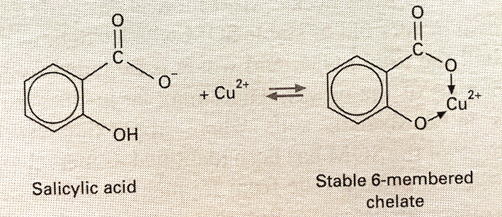
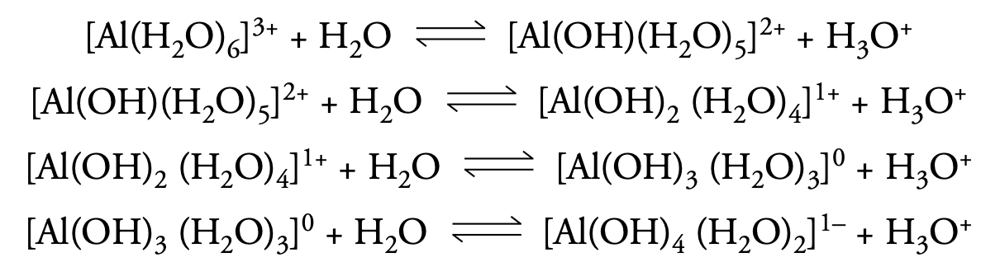
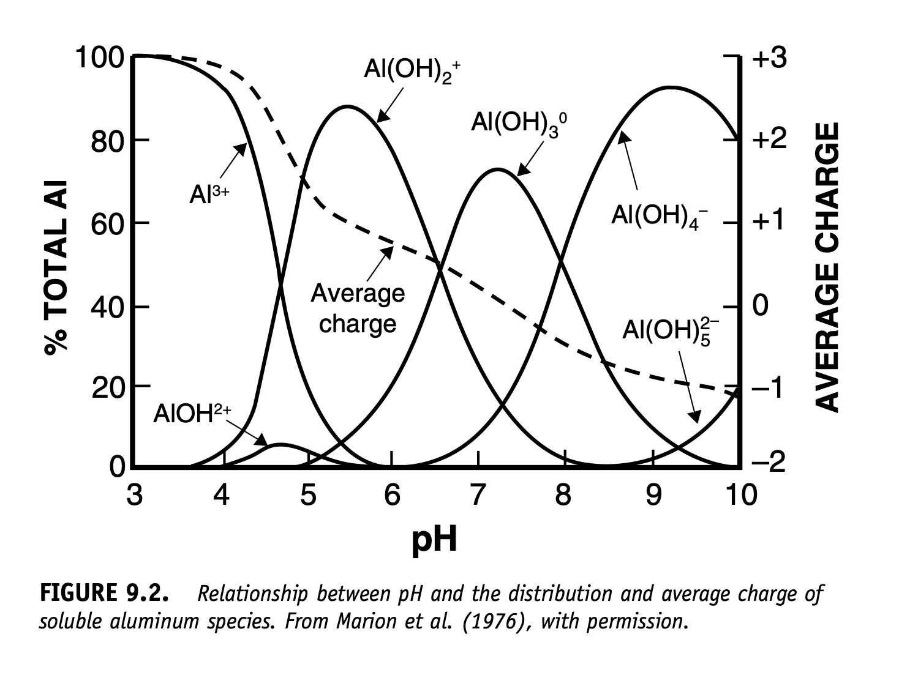

# Soil

## Soil particles

(From Hillel, pp. 61-62)

The main or principal groups of particles in soil are, in order of size, clay, silt and sand:

- clay

  - the colloidal particle fraction
  - clay has the largest surface area per unit mass and so is the most reactive physically and chemically
  - clay particles adsorb water, causing soil to expand on wetting and shrink on drying
  - clay particles are negatively charged and when they're hydrated they form a double layer with exchangeable ions in the soil solution around them

- silt

  - larger surface area per unit mass than sand and often coated with clay, so they may behave physically and chemically a little like clay

- sand

  
Silt and sand are relatively inert and make up the soil "skeleton". Clay is the "flesh" that supports a lot of the chemical, physical and biological activity in soil.


<br>

Much of the material on mineralogy below comes from: Essington, M. 2004. *Soil and Water Chemistry: An Integrative Approach*, CRC Press, Chapter 2.

<br>

## Soil mineralogy - introductory ideas

Minerals in soils can be 

- crystalline - these are naturally occurring inorganic compounds with atoms in a 3-D structure that repeats

- amorphous - these are naturally occurring inorganic compounds with no repeating structure


The O^2-^ anion is the dominant anion in soil minerals (47% by weight).

The *coordination number* is the number of anions that can be packed around a cation with no overlap. The bigger the cation, the more anions that can fit around it.

The figure below from Essington shows how charges of bonds are counted.

First, a definition: bond strength = cation valence / coordination number.

On the left are silicon tetrahedra, with the Si^4+^ ions in tetrahedral coordination, each surrounded by four O^2-^ ions. The strength of each Si-O bond is +4 / 4 = +1. The tetrahedra are bonded through a shared basal corner O^2-^ ion. The 2- charge on the O ion is exactly balanced by the 1+ charge on each of the two Si ions it's bonded to.

On the right hand side are Al^3+^ ions in octahedral coordination, each surrounded by six OH^-^ ions. The strength of each Al-OH bond is +3 / 6 = +1/2. Consequently, each OH^-^ ion can only be bonded by two Al^3+^ ions. The -2 charge on each O^2-^ ion is exactly balanced by its bond with two Al^3+^ ions and one H^+^ ion.


```{r echo = F, out.width = '80%', fig.align = 'center', fig.cap = 'Essington, Fig. 2.5, p. 41'}

knitr::include_graphics("figs/essington_soil_water_chem_fig_2-5.png")

```


A *unit cell* of a crystal is the smallest three-dimensional repeating unit of atoms. 


The most commonly occurring minerals in soil are the silicates. One class of silicates, the phyllosilicates or clay minerals, has a substantial effect on the physical and chemical properties of soil.

The *primary silicate minerals* formed as liquid magma cooled and make up the bulk of the sand- and silt-sized fractions of soil.

The *secondary silicate minerals*, formed from the weathering of the primary silicates or from precipitation of soluble mineral material, are found mainly in the clay fraction of soil and are responsible for many chemical reactions in soils.

<br>

## Climate

### Moisture

In moist or humid climates, water moves downwards, on balance, for most of the year. This leads to leaching of soluble minerals and translocation downwards of clay particles.


In arid climates, water moves upwards, on balance, over the year. This leads to salts being brought up the soil profile and closer to the surface.

### Temperature

Temperature affects the rate of mineral weathering and formation and biological processes, such as growth and decomposition.


<br>

## Parent material

Rocks are classified as igneous, sedimentary or metamorphic.


Notes below are based on:
https://australian.museum/learn/minerals/shaping-earth/classification-of-igneous-rocks/

### Igneous rocks

- these are formed by the solidification of molten magma in the Earth's crust or on the surface of the Earth's crust
- they are divided into classes based on grain size and silica content:

  - grain size
    - volcanic rocks - they solidify close to the Earth's surface and so cool quickly; they have finer grains
    - plutonic rocks - they solidify deep in the Earth's crust and cool slowly; they have coarse grains
    
  - silica content
    - *acidic* - rocks with more than 63% silica (mostly light-coloured K/Na feldspars and quartz); mainly *instrusive* (i.e. forming within the crust) - e.g. granite
    - *basic* - rocks with 45% to 55% quartz but high in dark-coloured ferromagnesian minerals (i.e. Fe and Mg) and Ca feldspars; mainly *extrusive* (i.e. forming on Earth's surface from lava) - e.g. basalt
    
    
### Metamorphic rocks

Igneous and sedimentary rocks that are subjected to high temperature and pressure have their mineral composition and structure changed and are transformed into metamorphic rocks. 

Under high temperature and pressure, existing minerals break down and form new minerals. Particular pressure/temperature conditions cause particular *index minerals* to form and these minerals can be used as one classifying feature of metamorphic rocks.

Apart from index minerals, other classifying features are grain size and degree of foliation.

Texture:

- foliated (leaf-like layers) - newly formed minerals align themselves perpendicular to the direction of stress; metamorphic rocks break easily along foliation planes
- non-foliated, massive or granular - a granular texture develops if a rock's chemical composition is similar to that of a particular mineral (e.g. marble - see below)

As the grade of metamorphism increases (i.e. higher pressure and temperature), crystal size increases and foliation becomes coarser (e.g. in limestone, calcite recrystallises into larger crystals and forms marble).


|               | Grain size |           |
|:--------------|:-----------|:----------|
| **Foliation** | Fine       |  Coarse   |
| Poor          | Hornfels   | Marble, quartzite|
| Good          | Slate      | Gneiss    |


### Sedimentary rocks

These are composed of the products of the weathering of igneous and metamorphic rocks and are formed when these products are deposited by wind or water. As more and more sediment layers are laid down, they exert weight on  deeper sediments, which harden and form rock.

Some sedimentary rocks form by precipitation of minerals, such as limestone.

<br>


## Chain silicates

In the figure below, silicon tetrahedra are shwon linked into single chains (top) and double chains (bottom).

Pyroxenes are made up of single chains of silicon tetrahedra linked through basal oxygen atoms. The basic unit is SiO~3~^2-^. How do you get this unit formula? Each Si-O bond has a strength of +4 / 4 = +1. The four O atoms in a single tetrahedron in focus are numbered. O no. 1 is shared with the neighbouring Si atom, so only half of it "belongs to" the tetrahedron in question. O nos. 2 and 3 both belong wholly to the focal tetrahedron. Like O no. 1, only half of O no. 4 is counted. So, there are one Si atom and three O atoms in the basic pyroxene unit, giving SiO~3~^2-^.

Amphiboles are made up of double chains of silicon tetrahedra linked through basal oxygen atoms. The basic unit is Si~4~O~11~^2-^. How so? The Si atoms are numbered 1 to 4. The set of tetrahedra with these Si atoms constitutes the basic repeating unit of the chains. Some of the oxygen atoms in this unit are marked in groups (with A, B and C), while the other six O atoms in the repeating unit are unmarked. Again, each Si-O bond has a strength of +1.

- The six unmarked O atoms in the unit belong wholly to the unit and contribute their full value. Contribution here is 6.

- O atoms marked A are shared with Si atoms in neighbouring tetrahedra, so each contributes half to the basic unit. Contribution here is 2.

- One of the O atoms marked B is shared between Si atoms 1 and 2 (i.e. half with each Si atom), both of which are in the basic unit, so that O atom contributes its full worth. The other O atom marked B is shared in the same way with Si atoms 3 and 4 and also contributes its full worth. Contribution here is 2.

- Oxygen atom C is shared in a similar way to the Bs, so also contributes its full worth. Contribution here is 1.

- Total oxygen "value" is 11.

This gives the basic unit of Si~4~O~11~^2-^.


```{r echo = F, out.width = '80%', fig.align = 'center', fig.cap = 'Essington, Fig. 2.10, p. 49'}

knitr::include_graphics("figs/essington_soil_water_chem_fig_2-10.png")

```


<br>

## Phyllosilicates

Phyllosilicates are sheet silicates or layer silicates. The basic unit is Si~2~O~5~^2-^. Each individual tetrahedron shares three basal O atoms, as shown below. The result is a sheet structure.


```{r echo = F, out.width = '80%', fig.align = 'center', fig.cap = 'Essington, Fig. 2.11, p. 50'}

knitr::include_graphics("figs/essington_soil_water_chem_fig_2-11.png")

```


An example of primary phyllosilicate minerals is the micas. They are 2:1 layer silicates - i.e. two silicate tetrahedral sheets sandwiching an octahedral sheet.

The basic unit of the octahedral sheets is three octahedra. If two out of the three positions available in the octahedra for cations are occupied by cations, the sheet is dioctahedral. If all three positions are occupied, the sheet is trioctahedral.

Isomorphous substitution occurs when an atom replaces another atom which has a similar size - e.g. Al^3+^ can replace Si^4+^ in a tetrahedral sheet and Fe^2+^, Fe^3+^ or Mg^2+^ can replace Al^3+^ in octahedral sheets.

If Al^3+^ substitutes for Si^4+^ in a tetrahedral layer in a dioctahedral mica, there will be a charge deficit of -1. This is balanced by K^+^ ions in the interlayer space.

In trioctahedral micas, the three octahedral spaces are occupied by divalent cations (e.g. Mg^2+^) to maintain the charge balance. If Al^3+^ substitutes for Si^4+^ in a tetrahedral layer in a trioctahedral mica, there will be a charge deficit of -1. This is balanced by K^+^ ions in the interlayer space, as in the dioctahedral case.

<br>

## Clay mineralogy

Clay minerals or clay material is made up of:

- phyllosilicates, of which there are three types, based on the ratio of tetrahedral to octahedral sheets

  - 1:1
  
  - 2:1
  
  - interlayered 1:1, 2:1 and octahedra

- accessory minerals - i.e. metal oxides, hydroxides and oxyhydroxides and organic matter.


### 1:1 phyllosilicates

Dioctahedral: kaolinite group

- Kaolinite is probably the most common aluminosilicate mineral in soil. 

- Its 1:1 layers are held together quite tightly by hydrogen bonding. It has low CEC (it has a little isomorphous substitution and also has some edge charge due to protonation and deprotonation).

Trioctahedral: serpentine group

### 2:1 phyllosilicates

These minerals are can be grouped according to layer charge.

The *mica* group, which consists of primary minerals, has a layer charge of about 0.6 to 2, due to isomorphous substitution (note that vermiculite is a secondary mineral derived from mica).

The *smectite* group has a layer charge of up to about 0.6 and includes both dioctahedral and trioctahedral minerals.

- As the layer charge of smectites is fairly low, water molecules and hydrated cations can get between the 2:1 layers.

- The hydrated cations in the interlayer space that satisfy the charge can be displaced and are exchangeable.

The *vermiculite* group has a charge between about 0.6 and 0.9.

- Even though the layer charge is higher than the smectites, water and hydrated cations can still get between the 2:1 layers.


### Interlayered 1:1, 2:1 and octahedra

This group includes, for example, the chlorite group, which is interlayered octahedral.


## Accessory minerals

These are mainly various oxides of Al, Fe^III^, Mn and Si. 

They are amphoteric - i.e. they can carry positive or negative charge depending on the characteristics of the soil solution.

Gibbsite, Al(OH)~3~, is a ubiquitous metal hydroxide, occurring particularly in highly weathered soils.

Compounds of iron are also very common, with goethite, FeOOH, the most common hydrous iron oxide.

Iron oxides accumulate in highly weathered soils, especially those that form from the weathering of *basic* rocks. All the iron oxides form by precipitation.

Haematite, an Fe^III^ oxide, Fe~2~O~3~, often occurs with goethite.

<br>

## Surface charge - and CEC

Cations (and anions) are adsorbed onto the surfaces of clay minerals and oxides owing to:

- permanent negative charge on clay minerals due to isomorphous substitution
- the amphoteric properties (i.e. can be negatively or positively charged) of the edges of kaolinite and the oxides and oxyhydroxides of Fe and Al.

The cation (or anion) charge adsorbed gives the *cation exchange capacity* (or CEC) of the mineral. Analogously, there is also the anion exchange capacity (AEC).

- For crystalline 1:1 and 2:1 phyllosilicates, permanent negative charge and so CEC is more important. Note CEC varies quite a lot within mineral groups.
  - In 2:1 clays, illites, for example, have a low CEC, as a lot of the charge is neutralised by interlayer K^+^, which is non-exchangeable. In vermiculites, however, the interlayer Ca^2+^ and Mg^2+^ are exchangeable and so the CEC is high.
  
- In sesquioxides, the charge *depends on pH*. Sesquioxides are positively charged up to a pH of 8 and so contribute nothing to CEC. 

<br>

## Soil organic matter

About 20% to 40% of what a plant produces through photosynthesis in a growing season is returned to the soil.

Plant cells are made up mostly of carbohydrates, proteins and fats.

Of the carbohydrates, sugars and starch are decomposed quickly, while celluose is less easily decomposed.

Proteins are quickly decomposed ultimately into amino acids.

Some of the amino acids are used by micro-organisms for growth.

Whether there is any surplus amino-N that is mineralised for plants to use depends on the C:N ratio of the substrate material and the type of micro-organisms.

When the C:N > 25, there is no excess N and all N is immobilised by the micro-organisms.

When C:N < 25, some mineralisation (see glossary) of N is likely.

Lignin, a complex phenolic polymer, makes up 10% to 20% of cereal straw dry matter and 20% to 30% of wood dry matter. It is not easily decomposed. When it is decomposed, monocyclic phenols are formed and these are then used by soil organisms to make humic macro-molecules.

<br>

## Soil organisms

One way of classifying soil organisms is by the method they use to make food:

- *heterotrophs* need C in the form of organic molecules; they include many species of bacteria and all fungi;
- *autotrophs* include remaining bacteria and most algae; can grow using C from CO~2~, deriving energy from sunlight (i.e. photosynthetic bacteria and algae) or else deriving energy from oxidising inorganic compounds (i.e. chemoautotrophs).

Another way of classifying them is according to their need for molecular O~2~:

- *aerobes* need O~2~ as the terminal electron acceptor in respiration 
- *facultative anaerobes* normally need O~2~ but can survive in anoxic conditions by using NO~3~^-^ and other inorganic compounds as electron acceptors in respiration 
- *obligate anaerobes* grow only in oxygen-free environments because oxygen is toxic to them


## Humus

Ageing plant material is invaded by micro-organisms that begin to decompose it. At the same time, biochemical changes occur in that ageing material, breaking down cell membranes. Plant material eventually falls to the ground, is invaded by many soil organisms and decomposition quickens, as shown by increasing CO~2~ production. This leads to:

- immobilisation of elements by micro-organisms (i.e. micro-organisms use elements for growth)
- mineralisation of elements, making them available for plants
- synthesis of new compounds that form a dark brown to black shapeless material called *humus*

This process of breaking down litter, releasing mineral nutrients and synthesising new compounds is *humification*.

The biochemical changes that occur in organic matter in the soil during decomposition and humus formation are complex! White (pp. 48-49) mentions some.

Two important features of humus are:

- humification produces organic colloids that have a high CEC
  - the CEC of soil organic matter depends completely on pH
    - the most important functional groups containing oxygen are those that dissociate to produce H^+^ ions and are the carboxylic and phenolic groups; carboxylic groups have a p*K* value between 3 and 5 and phenolic groups only release protons if pH > 7 (Note: For an acid, HA + H~2~O $\rightleftharpoons$ H~3~O^+^ + A^-^, *K*~a~ = [H~3~O^+^][A^-^] / [HA] and p*K* = -log~10~*K*; e.g. for acetic acid, CH~3~COOH, *K*~a~ = 1.8 $\times$ 10^-5^ and p*K* = 4.74; for formic acid, HCOOH, *K*~a~ = 1.8 $\times$ 10^-4^ and p*K* = 3.74)

- humic compounds can form coordination complexes with metallic cations, producing a *chelate* compound; phenolic groups are involved in this (see figure below).

<br>

```{r echo = F, out.width = "50%", fig.align = "center"}



```

<br>

## Peds and pores

Notes below are based on White, pp. 72-74; Young and Young, pp 62-63.

*Bulk density* = mass of oven-dry soil / total soil volume

*Volumetric water content* = volume of water / total soil volume

*Air-filled porosity* = volume of soil air / total soil volume

*Field capacity* is water content at a suction of 10 kPa (Australian definition). See below also.

*Permanent wilting point* is water content at a suction of 1,500 kPa.

*Available water capacity* is the nominal amount of soil water that plants can use. The upper limit is the water content at field capacity and the lower limit is the water content at which plants can no longer extract water from the soil, lose turgor and wilt - i.e. permanent wilting point (turgor is the normal rigidity of plant cells caused by the pressure of the cell contents against the cell wall). The plant-available water capacity for a particular planted area or crop is the difference between the volumetric water content at field capacity and that at permanent wilting point (summed through the root zone).

Note the above three values are a little arbitrary!

*Pore space ratio* = volume of pores / total soil volume

Note pore space ratio tells you nothing about the size distribution of the pores.

In a soil with reasonable structure, pores can be classed as *macropores* or *micropores*. 

*Macropores* are the pores between soil aggregrates. They allow water to infiltrate and drain through the soil. Water can drain into and through them under the influence of gravity. Air also enters and moves through the soil in them; they are responsible for soil aeration. When the macropores are drained, the soil is at field capacity.

*Micropores* are the pores inside soil aggregates. They are responsible for the storage of water and solutes. The water in these pores is held onto the soil particles by adhesion and surface tension, so a suction has to be applied to remove it. The water in micropores can be removed by evaporation and can be extracted by plants but does not drain out under the influence of gravity.

With rain or irrigation, water infiltrates and wets the soil. The drainage rate often becomes very small 1 - 2 days after the rain or irrigation stops. The reason is that when most of the macropores have drained, there is a large drop in hydraulic conductivity. The water content at this point is usually taken as field capacity (although in Australia, field capacity is set at a suction of 10 kPa, which is around about this point).


## Soil structure and aggregation

Soil with a reasonable amount of clay in it forms *aggregates*:

- *macroaggregates* or *peds* - visible, usually from a few millimetres to a few centimetres in diameter, and are made up of groupings of

- *microaggregates*, which are made up of groupings of the primary particles, clay, silt and sand; bundles of clay particles attach themselves to the larger silt and sand particles or sometimes even surround them; *the fundamental mechanism that gives microaggregates stability is clay particles binding together*

*Roots* contribute to soil structure:

- roots travel around and through aggregates, creating a three-dimensional "mesh" in the soil

- roots exert pressure on aggregates, compressing and separating them

- roots take up water from the soil, causing localised dryness, shrinkage and cracking of soil in the root zone

- roots and root hairs grow and die, promoting microbial activity and this results in "humic cements" being produced

- these cements are often broken down in turn by microbes, so organic matter has to be constantly supplied to the soil to maintain the stability of the aggregates

If the soil surface has no protective cover and is left exposed (e.g. after harvesting annual crops), the topsoil will dry out, resulting in desiccation:

- if it is then cultivated, the dried aggregates can be reduced to dust

- if it rains on the dry aggregates, they may slake

If the soil is cultivated when it is very wet, the churning effect of cultivation causes compaction.

Humus is accululated best and soil aggregates stabilised most effectively under perennial vegetation.


*Microbes* contribute to soil structure:

- microbial activity varies over time as does the mix of microbes, which include protozoa (one-celled organisms with a true nucleus containing DNA - eukaryotes), bacteria (one-celled organisms without a true nucleus, where DNA is contained in the cytoplasm - prokaryotes), fungi and actinomycetes (bacteria that can break down more resistant carbon compounds like lignin) 

- bacteria living in the rhizosphere are particularly important

- fungi are also particularly important, as they produce extensive networks of hyphae (or mycelia)

- soil microbes bind aggregates by adsorption, physical entangling the particles and excreting viscous material that acts like a glue

- microbial excretions (organic polymers):

  - can be adsorbed onto clay surfaces
  
  - can penetrate between individual clay particles
  
  - can form a protective coating around soil aggregates
  
  - can dissolve in the soil solution, penetrate aggregates and then precipitate in the aggregate forming an internal cement
  
Some inorganic substances can also act like a cement:

-  calcium carbonate and iron and aluminium oxides can contribute a lot to aggregate stability (in soils without much organic matter - e.g. tropical soils - these substances can provide considerable stability)


<br>

## Stability

### Slaking

Putting a ped into water results in the water infiltrating the ped. The infiltrating water will increase the pressure of the air in the pores in the ped. If the air bubbles out and the ped remains intact, it is stable. If the ped breaks up, it has "slaked". This means it does not have enough material to hold it together strongly enough to withstand the increased air pressure.


### Dispersion

If the ped, after putting it into water, produces cloudiness in the water, it has "dispersed". This is the result of the clay particles in the ped becoming separated from one another (deflocculation). It shows that the clay layers in the particles were initially bound together by sodium ions. Sodium ions are large ions with a single charge, Na^+^, and are in the clay interlayer spaces. Water molecules can move into the interlayer spaces, attracted by the sodium ions, and hydrate those ions. This increases the space between the clay layers to such an extent that the layers separate and the clay particle disintegrates. This causes the cloudiness around the ped. Such a soil is "sodic".

Calcium ions, Ca^2+^, are smaller and hold the clay layers together more strongly than sodium. Water cannot move into the interlayer space if calcium ions are binding the layers together. Water molecules can only move to the edge of the particles under any attraction by the calcium ions but do  not break the calcium-clay bonds.

Organic matter, iron and aluminium sesquioxides and cations, especially calcium and magnesium, encourage flocculation (i.e. bind clay layers together).


## Soil acidity and pH

Most of the stuff below comes from Sparks, *Environmental Soil Chemistry*, chapter 9.

### Various introductory comments

Soil acidity affects the availability of:

- nutrients
  - macronutrients are more available above a pH of about 5.5
  - micronutrients are more available below a pH of about 6
- bacteria and actinomycetes like a pH above about 5.5
- fungi don't really care about pH (4 < pH < 9), as long as it's not extreme
  
In most soils, soil acidity is related to H and Al. The latter is more important except when pH < 4.

At low pH, Al, Fe and Mn - and heavy metals - become more soluble and can be toxic to plants. As pH increases, they become less soluble and start to precipitate.

### Acid sulphate soils - a little aside

Acid sulphate soils occur on marine floodplains in temperate and tropical climates. When these floodplains are drained, pyrite in the soil is oxidised and high levels of acidity produced. Disulphide (S~2~^2-^) is oxidised by ferric iron (Fe^3+^) to produce sulphate (SO~4~^2-^), ferrous iron (Fe^2+^) and protons.

This is Sparks' equation (p. 270):

|        FeS~2~ + 15/4 O~2~ + 7/2 H~2~O $\rightarrow$ Fe(OH)~3~ + 2H~2~SO~4~

<br>

Essington gives his version, including the half reactions (p. 446):

|        FeS~2~(s) + 8H~2~O(l) $\rightarrow$ Fe^2+^(aq) + 2SO~4~^2-^(aq) + 16H^+^(aq) + 14e^-^
|  
|        14Fe^3+^(aq) + 14e^-^ $\rightarrow$ 14Fe^2+^(aq),

<br>

with the overall reaction

|        FeS~2~(s) + 14Fe^3+^(aq) + 8H~2~O(l) $\rightarrow$ 15Fe^2+^(aq) + 2SO~4~^2-^(aq) + 16H^+^(aq)

<br>

Here, Fe^3+^ is the oxidant and S^2-^ is the reductant.

(*Another aside:* The pyrite structure also occurs in other MX~2~ compounds, where M is a transition metal and X is a member of the oxygen group (O, S, Se and Te).)


### Al and soil acidity

Al hydrolyses in an aqueous solution - this reaction is reversible. (Hydrolysis is a reaction where a substance is split or decomposed by water.)

There's a set of reactions "starting" with [Al(H~2~O)~6~]^3+^ and "ending" with  [Al(OH)~4~(H~2~O)~2~]^1-^. The product of each hydrolysis reaction is a monomeric Al ion and H~3~O^+^. At each "step", one molecule of water is deprotonated.

The start is 

|        [Al(H~2~O)~6~]^3+^ + H~2~O $\rightleftharpoons$ [Al(OH)(H~2~O)~5~]^2+^ + H~3~O^+^

and it just goes on from there. See below.


```{r echo = F, out.width = '60%', fig.align = 'center', fig.cap = 'Sparks, p. 271'}



```


Two points are noteworthy:

- the amount the pH drops as these reactions occur depends on the concentration of Al in the soil solution;
- the relative concentrations of the various Al ions depend on the pH of the soil solution:
  - if pH < 4.7 or pH > 7.5, the concentration of Al^3+^ quickly increases.

If 4.7 < pH < 7.5, the solubility of Al is low and it precipitates as Al(OH)~3~.


```{r echo = F, out.width = '70%', fig.align = 'center', fig.cap = 'Sparks, Fig. 9.2, p. 272'}



```

<br>

Free Al^3+^ might only account for a small proportion of Al in the soil solution. There may be quite a lot bound to fluoride or sulphate ions, humic material or organic acids.


As pH increases, the amount of Al^3+^ decreases and various monomeric (one Al atom) and polymeric (more than one Al atom) hydroxy-Al species become more common. These latter species can occur in the interlayers of smectite and vermiculite, in organic complexes and oxyhydroxide coatings on clay particles.

These hydroxy-Al species are non-exchangeable (because they cannot be replaced or extracted by a salt like KCl).

The polymers are large and positive and are more likely to be in interlayer spaces than monomeric species.

If these polymeric species are arranged around the edge of the interlayer space, they can block other ions reaching exchange sites further into the interlayer space. 

If they are arranged throughout the interlayer space, they act as props, keeping the interlayer space open, and increase ion exchange.


### Soil acidity - some (more) detail

The main forms of acidity in mineral soils relate to Al; the two main forms are exchangeable (or *extractable*, since the technique used can affect the result) and nonexchangeable.

Exchangeable acidity is the amount of total CEC due to H^+^, contributing the smaller component) and Al^3+^, the larger component. 

The amount of exchangeable acidity depends on the soil type, and so the amount of CEC due to exchangeable bases (i.e. Ca^2+^, Mg^2+^, K^+^ and Na^+^).

The proportion of exchangeable acidity out of total acidity decreases in this order:

- montmorillonite - it has mostly constant charge sites
- dioctahedral vermiculites - a substantial amount of their acidity is nonexchangeable and made up of polymeric hydroxy-Al material in the interlayer space and depends on pH
- kaolin minerals - it has low CEC and variable charge

Al and Fe coatings on clay particles reduce the amount of exchangeable acidity that can be extracted and so reduce the proportion of exchangeable acidity in the total acidity.


### Acidity and weathering

Essington, pp. 473ff

Soil acidification is a natural result of weathering.

- During weathering, carbonic and organic acids hydrolyse soil minerals.

- Base cations (Ca^2+^, Mg^2+^, K^+^, Na^+^) and silica become soluble (are "solubilised").

- Other products of weathering, such as soluble Al^3+^ and Fe^3+^, hydrolyse, producing protons in the process and also, on the Al side, mainly AlOH^2+^ and Al(OH)~2~^+^.

- Al species (Al^3+^, AlOH^2+^ and Al(OH)~2~^+^) then displace base cations from the exchange complex.

- In areas where rainfall exceeds evapotranspiration, base cations (Ca^2+^, Mg^2+^, K^+^, Na^+^), which do not hydrolyse to produce protons, are leached from the soil.

- *The fundamental cause of soil acidity is Al species occupying the exchange complex. These Al species are labile (i.e. they can be removed from the exchange complex easily and hydrolysed, producing protons).* 

Many soils across the world, such as soils in the humid tropics and in forests in temperate zones, are acidic.


### Acidity and biological processes

See Essington, *Soil and Water Chemistry*, chapter 10.

{p. 482}

Most oxidation reactions produce protons. Most reduction reactions consume protons. **Curious!**

Systems with lots of electrons are reduced (here hydrogen will be more stable relative to water) and those depleted of electrons are oxidised  (here, oxygen will be more stable relative to water) (Essington, pp. 445 & 447).

You need to look at the whole redox reaction to see what's happening - oxidation or reduction half-reactions on their own don't show the full picture.

*Example*

Oxidising ammonium can potentially lead to acidification through nitrification:

|        NH~4~^+^ (aq) + 2O~2~(g) $\rightarrow$ NO~3~^-^(aq) + 2H^+^(aq) + H~2~O(l)

Nitrification will only lead to acidification if the nitrate and base cations are leached from the soil.

If this leaching happens, the protons produced by nitrification will stay in the soil. They will occupy organic exchange sites and also take part in mineral weathering.

The Al dissolved in this weathering will hydrolyse, producing more acidity and also displace base cations from exchange sites.

If the nitrate is not leached, acidification may not occur. This is because, when plants absorb a nutrient anion, they release OH^-^ and HCO~3~^-^, generating alkalinity:


|        [equivalents anions absorbed] - [equivalents cations absorbed] = [equivalents hydroxide
|            and hydrogen carbonate released]


Similarly, when plant roots absorb cations, acidity is generated:

|        [equivalents cations absorbed] - [equivalents anions absorbed] = [equivalents protons released]

<br>

Plants usually absorb more cations than anions, so, on the whole, more protons are released than hydroxide and hydrogen carbonate. The pH of the rhizosphere can be up to two units lower than the soil solution.


### Neutralising soil acidity, liming ...

Sparks, pp. 281-282

To neutralise soil acidity, apply lime. The general reaction is:

|        CaCO~3~ + H~2~O $\rightarrow$ Ca^2+^ + HCO~3~^-^ + OH^-^

<br>

The hydroxide reacts with existing H^+^ or H^+^ formed by hydrolysing Al^3+^:

|        2 Al-soil + 3CaCO~3~ + 3H~2~O $\rightarrow$ 3 Ca-soil + 2Al(OH)~3~ ($\downarrow$) + 3CO~2~

<br>

The products are Ca^2+^, which can move onto exchange sites, and Al(OH)~3~, which precipitates, removing Al from exchange sites and the soil solution (more on this from Essington below).

<br>

Essington, s. 10.3 & 10.4, pp. 483ff.

Revisiting soil acidity. If less H^+^ is neutralised than is produced by acid-forming processes, soil becomes acidic. Some of these neutralising processes are:

- mineral weathering
- plants taking up anions
- anions or surface functional groups being protonated
- base cations being retained on exchange sites
- reduction reactions


*Definitions*

*Acid-neutralisation capacity* of the soil solid phase (ANC)

- When K-feldspar, for example, is weathered by hydrolysis (i.e. dissolved), protons are consumed. This reduces the ANC of the soil solids by using up minerals (i.e. K-feldspar) that can neutralise protons.
- When Al^3+^ is hydrolysed, gibbsite (Al(OH)~3~) is precipitated and protons are produced. This increases the ANC of the soil solids by producing a mineral that can neutralise protons (i.e. the reaction could go the other way, if conditions were right).
- The soil exchange complex responds quickly to any change in the soil solution.
- The ANC of the soil solids exchange complex (soil exchange phase ANC) is the amount of surface charge on the exchange complex that equals the charge of the exchangeable bases adsorbed on the complex. These exchangeable bases are the metals that do not hydrolyse at usual soil pH (Ca^2+^, Mg^2+^, K^+^, Na^+^).
- The ANC of the soil exchange pahse is also called "base saturation".

So, ...

*Total acidity*

- Total acidity of a soil = CEC - ANC (i.e. the part of the CEC not occupied by exchangeabe base cations)
- Actual total acidity is also called exchangeable acidity. (There is also non-exchangeable acidity. This is made up of Al species and protons that are bound onto surfaces but that cannot be displaced. This is not part of total acidity.)
- It's mainly made up of 
  - Al^3+^ and Al(OH)~2~^+^ on clay exchange sites
  - Al species and protons that are in complexes with organic functional groups
  
<br>

Back to neutralising soil acidity ...

The point at which soil acidity needs to be reduced for optimal plant growth is not based on pH but on total acidity. Well, ...!

When total acidity reaches more than about 15 % of CEC, soil acidity needs to be reduced.

To reduce acidity to an appropriate level, base cations need to be added to remove acidic species from the exchange complex. Usually, Ca^2+^ or Mg^2+^ is added.

The lime requirement is based on the amount of these base cations needed to reduce total acidity and is not based on the pH.

Tests used to work out how much base cation is needed are built on buffer tests incorporating measured changes in pH values and give approximate values.

The liming materials usually used are limestone (CaCO~3~) and dolomite (CaMg(CO~3~)~2~).

Adding CaCO~3~ initially consumes protons but the overall soil neutralisation reaction *conserves* protons.

The aims of liming are to:

- displacing Al species from the exchange phase by base cations
- precipitate the Al that has been displaced

The reactions go like this:

|        3CaCO~3~(s) + 6H^+^(aq) $\rightarrow$ 3Ca^2+^(aq) + 3CO~2~(g) + 3H~2~O(l)

<br>

This first reaction quickly increases the pH of the soil solution. This increased pH promotes Ca^2+^ moving onto exchange sites:

|        3Ca^2+^(aq) + 2AlX~3~(ex) $\rightarrow$ 3CaX~2~(ex) + 2Al^3+^(aq)

<br>

The raised pH also promotes Al precipitating:

|        2Al^3+^(aq) + 3H~2~O(l) $\rightarrow$ 2Al(OH)~3~(s) + 6H^+^(aq)

<br>

Adding the three equations above together gives the overall reaction equation:

|        3CaCO~3~(s) + 2AlX~3~(ex) + 3H~2~O(l) $\rightarrow$  3CaX~2~(ex) + 2Al(OH)~3~(s) + 3CO~2~(g) 

<br>

Note that there is no net decrease in H^+^ ions.


