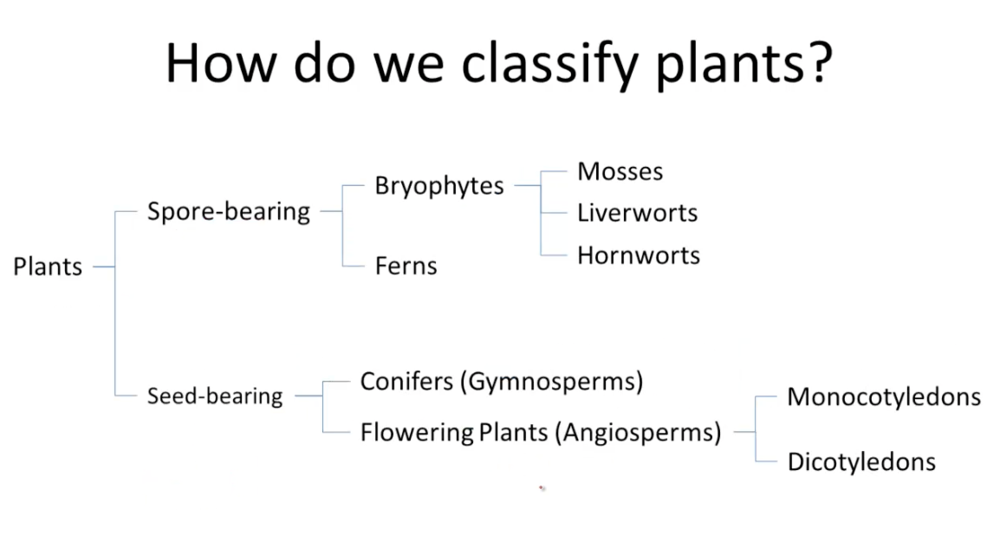
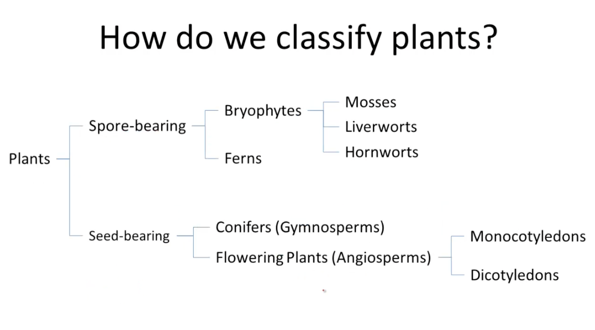

# Plants

## Plant classification

Plants can be classified in more than one way. The method you choose depends on what differences you want to highlight.

One method divides plants into those with vascular tissue and those with non-vascular tissue. Vascular tissue transports water and nutrients up the roots and stems. The diagram below is simplified and does not include all plant groups. As it is based on whether vascular tissue is present, it highlights the evolution of water independence in plants. Non-vascular plants (e.g. mosses) need to live in or near a moist environment. Vascular plants (e.g. ferns and seed-bearing plants), on the other hand, can live in drier environments as they can obtain water through their roots.


```{r echo = F}



```


Dividing plants into spore-bearing and seed-bearing plants focusses on the ways in which plants reproduce. Gymnosperms and angiosperms bear seeds, while all other plants reproduce via spores. Seeds gave plants a better chance of survival.


```{r echo = F}



```


(Reference: https://bio.libretexts.org/Bookshelves/Introductory_and_General_Biology/Book%3A_Introductory_Biology_(CK-12)/09%3A_Plants/9.06%3A_Plant_Classification)


Ferns are the class Filicinae.

Gymnosperms are a class and include the orders Conifers, Cycads and Gingko. They produce seeds in cones and do not flower.

Angiosperms are a class and are divided into the sub-classes Monocots (or Liliopsida) (e.g. palms, grasses) and Dicots (or Magnoliopsida) (e.g. flowering trees, shrubs and climbers) and produce seeds in flowers.

Under Kingdom, the next taxonomic rank is division (in botany) and phylum (in zoology).


### Suffixes in taxonomic ranks in botany

(See: https://en.wikipedia.org/wiki/Taxonomic_rank)

Division: -ophyta

Class: -opsida

Subclass:  -idae

Order:  -ales

Family:  -aceae

Subfamily:  -oideae


## Primary and secondary growth

Primary growth results from cell division in the tips of the stem and roots and results in the stems and roots lengthening.

Secondary growth results from cell division in the cambium, producing xylem on the inside and phloem on the outside and so causing the stem to thicken. Secondary growth occurs in dicots and gymnosperms but not usually in monocots. Monocots may have "anomalous secondary growth". Palms, for example, increase their stem diameter by parenchyma cells dividing and enlarging, a process where no secondary xylem or phloem is formed (https://en.wikipedia.org/wiki/Secondary_growth). Parenchyma cells are a type of *ground tissue*, which is tissue that is not on the external surface of plants or part of vascular tissue. It's a type of "filler" tissue in the soft parts of plants (https://en.wikipedia.org/wiki/Ground_tissue). There are different types of anomalous secondary growth in other monocots.


<br>

## Plant characteristics

When talking about the type and life form of a plant, move from left to right through the characteristics below.

|  Lifetime  | Primary/Secondary Growth |            |
|:----------:|:------------------------:|:----------:|
| Annual     |            |  Grow, flower, seed and die in one year or less |
| Perennial  |  Softwood  |  Evergreen  |
| Perennial  |  Softwood  |  Herbaceous |
| Perennial  |  Hardwood  |  Trees, shrubs, climbers |

<br>

When describing the features of a plant, do it in the order below for consistency!

**Habit**

- include stem characteristics


**Leaf**

- arrangement
- shape
- size
- margin type
- texture and surfaces
- colour
- scent

**Flowers**

- inflorescence type
- position
- flower shape
- size
- colour
- scent
- season

<br>

## Plant tissues

Note: References are from: RAV - Raven et al., *The Biology of Plants*

After the embryo has formed, new plant cells are produced by the **meristems**. Meristems are tissues (i.e. tissues are groups of cells that are similar and perform specific functions) where cells that are undifferentiated undergo cell division by mitosis. 

There are two main types of meristem (RAV, p. 6):

- apical meristem - are at tips of shoots and roots and are involved with extension growth of the plant (i.e. often vertical growth) - this type of growth is primary growth

- lateral meristem - this consists of the vascular cambium and cork cambium, which are involved with increasing the thickness or girth of stems, branches and roots - this type of growth is secondary growth

In both apical and lateral meristems, some cells can repeatedly divide; one of the cells produced stays in the meristem ("initial"), the other eventually becomes a new plant body cell ("derivative) - these two new cells are not different from each other, but take on their roles from their position in the meristem (RAV, p. 453). 

There are three types of primary meristem:

- protoderm - produces the future epidermis, a single layer of cells forming the outermost layer of the stem

- ground meristem - produces the ground tissue (mostly parenchyma cells), which in a stem, surrounds the vascular tissue

- procambium - produces the vascular tissue (i.e. xylem and phloem)

These three tissues are primary meristems because (RAV, p. 454):

- they produce primary tissues

- many of their cells can divide and remain undifferentiated for some time (i.e. they can divide again) before they differentiate into specific types of cell

### Primary growth

The shoot develops to a certain stage in the embryo and consists of a *plumule* (the stem), *leaf primordia* (rudimentary leaves) and an *apical meristem*. During germination, new seed leaves develop from the apical meristem and the stem lengthens, forming nodes and internodes, and *bud primordia* form in leaf axils. The growing terminal bud often inhibits the lateral buds from growing - this is *apical dominance*. As the distance between the shoot tip and the lateral buds increases, the terminal bud exerts progressively less influence on the lateral buds and they grow more (RAV, p. 488).


<br>


### Xylem

See RAV, p. 453

Xylem is the main type of plant tissue that conducts water and minerals in vascular plants. It's made up of two types of cell, tracheids and vessel elements (or vessel members).

There are two types of xylem:

- primary xylem - produced by the inner cells of the procambium (RAV, p. 492)
- secondary xylem - produced by the vascular cambium

During primary growth, primary xylem cells may be stretched, although many are destroyed during elongation.

<br>

### Phloem

See RAV, p. 453

Phloem is the main type of plant tissue that transports food. The main types of phloem cells are sieve cells and sieve-tube members.

There are two types of phloem:

- primary phloem - produced by the outer cells of the procambium (RAV, p. 492)
- secondary phloem - produced by the vascular cambium

During primary growth, primary phloem cells are often stretched and destroyed during elongation.

<br>


### Secondary growth


### Vascular cambium

See RAV, p. 521-522

The vascular cambium is a single layer of cells between the primary xylem and primary phloem that stays meristematic.

Secondary phloem and secondary xylem are produced by periclinal divisions of the cambial initials and their derivatives.

After periclinal division of vascular cambial initials, those derivatives that are on the inside become xylem cells, while those on the outside become phloem cells.

Xylem and phloem cells produced from fusiform initials have their long axis orientated vertically and make up the *axial system* of secondary vascular tissue.

Cells produced from ray initials are called ray cells and are orientated horizontally. They form the *vascular rays* or *radial system*.

Vascular rays:

- move food from secondary phloem to secondary xylem
- move water from secondary xylem to secondary phloem
- store start, protein and lipids

As the vascular cambium produces more and more secondary xylem cells, the width of the xylem cell region increases and the cambium is pushed outwards. The circumference of the vascular cambium increases to allow this by anticlinal division of initials.


### Growth rings

See RAV, p. 535

The activity of the vascular cambium changes with the seasons in temperate climatic zones. This produces growth rings in the secondary xylem and secondary phloem. If a growth layer represents growth over one year, it's an *annual ring*. The width of an individual growth ring depends on environmental factors:

- light
- temperature
- rainfall
- available soil water
- length of growing season

In semi-arid areas, the growth rings of a tree give a very good picture of the relative amount of rain that has fallen.


<br>

```{r echo = F, out.width = '55%', fig.align = 'center', fig.cap = 'Raven, Fig. 24-4, p. 522'}

knitr::include_graphics("figs/periclinal_anticlinal_rav_fig_24-4.png")

```
Figure 2.1 caption:

Periclinal and anticlinal divisions of fusiform initials (vertically elongated cells). (a) Periclinal divisions are involved in forming secondary phloem and secondary xylem cells and result in the formation of radial rows of cells (see Fig. 24-5 below). When an initial divides periclinally, two cells appear, one behind (or in front of) the other. (b) Anticlinal divisions are involved in the multiplication of fusiform initials. When an initial divides anticlinally, two cells appear side by side.

<br>
<br>

```{r echo = F, out.width = '55%', fig.align = 'center', fig.cap = 'Raven, Fig. 24-5, p. 522.'}

knitr::include_graphics("figs/secondary_growth_rav_fig_24-5.png")

```

Figure 2.2 caption:

Diagram showing the relationship of the vascular cambium to its derivative tissues - secondary xylem and secondary phloem. The darker cells are the more recently derived ones. The vascular cambium is made up of two types of cell - fusiform initials (vertically elongated cells) and ray initials (horizontally elongated cells) - which give rise to the axial and radial systems, respectively, of the secondary vascular tissues. When the cambial initials produce secondary xylem and secondary phloem, they divide periclinally. Following division of an initial, one daughter cell (the initial) remains meristematic, and the other (the derivative of the initial) eventually develops into one or more cells of the vascular tissue. Cells produced toward the inner surface of the vascular cambium become xylem elements and those produced toward the outer surface become phloem elements. The ray initials divide to form vascular rays, which lie at right angles to the derivatives of the fusiform initials. With the production of additional secondary xylem, the vascular cambium and secondary phloem are displaced outwards. The diagrams (left to right) represent successively more mature stages.


<br>

## Reaction wood

SEe RAV, p. 538

Reaction wood is abnormal wood that develops in trunks or branches that are leaning.

*To be finished*


